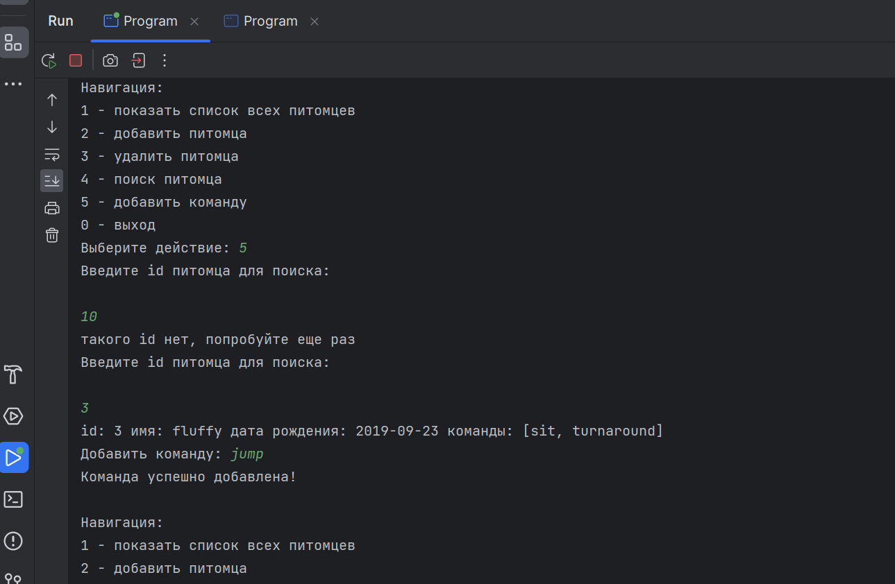

# Рогова Вера Николаевна Итоговая контрольная работа по блоку Разработчик — Программист. Специализация

__*Организуйте систему учёта для питомника, в котором живут домашние и вьючные животные*__

## Задание
### Часть 1. Работа с Linux-Ubuntu
1. Используя команду cat в терминале операционной системы Linux, создать
   два файла Домашние животные (заполнив файл собаками, кошками,
   хомяками) и Вьючные животными заполнив файл Лошадьми, верблюдами и
   ослы), а затем объединить их. Просмотреть содержимое созданного файла.
   Переименовать файл, дав ему новое имя (Друзья человека).

1.1 Создаю директорию для сохранения итоговой контрольной работы `ControlTest` и все остальные файлы создаю в этой папке

```sh
veranik@veranik-VirtualBox:~$ mkdir ControlTest
veranik@veranik-VirtualBox:~$ cd ControlTest/
```

1.2 Cоздаю два файла `Домашние животные` (заполнив файл собаками, кошками, хомяками) и `Вьючные животные` (заполнив файл Лошадьми, верблюдами и ослы)
```sh
veranik@veranik-VirtualBox:~/ControlTest$ cat > 'Домашние животные'
Собаки
Кошки
Хомяки
```
```sh
veranik@veranik-VirtualBox:~/ControlTest$ cat > 'Вьючные животные'
Лошади
Верблюды
Ослы
```
1.3 Объединяю файлы в один файл `Друзья человека`).
```sh
veranik@veranik-VirtualBox:~/ControlTest$ cat 'Домашние животные' 'Вьючные животные' > 'Друзья человека'
```

1.4 Просматриваю содержимое созданного файла `Друзья человека`.
```sh
veranik@veranik-VirtualBox:~/ControlTest$ cat 'Друзья человека'
Собаки
Кошки
Хомяки
Лошади
Верблюды
Ослы
```

2. Создать директорию, переместить файл туда.

Создаю новую директорию `NewPath` и перемещаю файл туда.
```sh
veranik@veranik-VirtualBox:~/ControlTest$ mkdir NewPath
veranik@veranik-VirtualBox:~/ControlTest$ mv 'Друзья человека' NewPath
```
```sh
veranik@veranik-VirtualBox:~/ControlTest$ ll
total 20
drwxrwxr-x  3 veranik veranik 4096 авг  1 22:36  ./
drwxr-x--- 15 veranik veranik 4096 авг  1 19:59  ../
drwxrwxr-x  2 veranik veranik 4096 авг  1 22:36  NewPath/
-rw-rw-r--  1 veranik veranik   39 авг  1 22:17 'Вьючные животные'
-rw-rw-r--  1 veranik veranik   38 авг  1 22:15 'Домашние животные'
```
```sh
veranik@veranik-VirtualBox:~/ControlTest$ cd NewPath/
veranik@veranik-VirtualBox:~/ControlTest/NewPath$ ll
total 12
drwxrwxr-x 2 veranik veranik 4096 авг  1 22:36  ./
drwxrwxr-x 3 veranik veranik 4096 авг  1 22:36  ../
-rw-rw-r-- 1 veranik veranik   76 авг  1 22:24 'Друзья человека'
```
```sh
veranik@veranik-VirtualBox:~/ControlTest/NewPath$ cat Друзья\ человека
Собаки
Кошки
Хомяки
Лошади
Верблюды
Ослы
```


3. Подключить дополнительный репозиторий MySQL. Установить любой пакет из этого репозитория.

3.1 Проверяем обновления
```sh
veranik@veranik-VirtualBox:~/ControlTest/NewPath$ sudo apt update
[sudo] password for veranik:
Hit:1 http://ru.archive.ubuntu.com/ubuntu jammy InRelease
Get:2 http://ru.archive.ubuntu.com/ubuntu jammy-updates InRelease [119 kB]
Get:3 http://ru.archive.ubuntu.com/ubuntu jammy-backports InRelease [108 kB]
Get:4 http://security.ubuntu.com/ubuntu jammy-security InRelease [110 kB]
Fetched 337 kB in 1s (302 kB/s)    
Reading package lists... Done
Building dependency tree... Done
Reading state information... Done
291 packages can be upgraded. Run 'apt list --upgradable' to see them.
```
3.2 Устанавливаю mysql-server и mysql-client
```sh
veranik@veranik-VirtualBox:~/ControlTest/NewPath$ sudo apt install mysql-server
veranik@veranik-VirtualBox:~/ControlTest/NewPath$ sudo apt install mysql-client
```


3.3 Удаляем mysql-server и mysql-client, т.к. в дальнейшем будем работать в контейнере
```sh
veranik@veranik-VirtualBox:~/ControlTest/NewPath$ sudo apt purge mysql-server mysql-client
```


4. Установить и удалить deb-пакет с помощью dpkg.

4.1 Скачиваем пакет mysql-apt-config
```sh
veranik@veranik-VirtualBox:~/ControlTest/NewPath$ wget https://dev.mysql.com/get/mysql-apt-config_0.8.25-1_all.deb
--2023-08-01 23:06:16--  https://dev.mysql.com/get/mysql-apt-config_0.8.25-1_all.deb
Resolving dev.mysql.com (dev.mysql.com)... 23.52.29.249, 2a02:2d8:3:9a5::2e31, 2a02:2d8:3:9a9::2e31
Connecting to dev.mysql.com (dev.mysql.com)|23.52.29.249|:443... connected.
HTTP request sent, awaiting response... 302 Moved Temporarily
Location: https://repo.mysql.com//mysql-apt-config_0.8.25-1_all.deb [following]
--2023-08-01 23:06:17--  https://repo.mysql.com//mysql-apt-config_0.8.25-1_all.deb
Resolving repo.mysql.com (repo.mysql.com)... 184.50.200.228
Connecting to repo.mysql.com (repo.mysql.com)|184.50.200.228|:443... connected.
HTTP request sent, awaiting response... 200 OK
Length: 18120 (18K) [application/x-debian-package]
Saving to: ‘mysql-apt-config_0.8.25-1_all.deb’


mysql-apt-config_0. 100%[==================>]  17,70K  --.-KB/s	in 0s 	 


2023-08-01 23:06:17 (190 MB/s) - ‘mysql-apt-config_0.8.25-1_all.deb’ saved [18120/18120]
```
4.2 Устанавливаем пакет mysql-apt-config
```sh
veranik@veranik-VirtualBox:~/ControlTest/NewPath$ sudo dpkg -i mysql-apt-config_0.8.25-1_all.deb
Selecting previously unselected package mysql-apt-config.
(Reading database ... 200446 files and directories currently installed.)
Preparing to unpack mysql-apt-config_0.8.25-1_all.deb ...
Unpacking mysql-apt-config (0.8.25-1) ...
Setting up mysql-apt-config (0.8.25-1) ...
```

4.3 Удаляем пакет mysql-apt-config
```sh
veranik@veranik-VirtualBox:~/ControlTest/NewPath$ sudo dpkg -r mysql-apt-config
(Reading database ... 200451 files and directories currently installed.)
Removing mysql-apt-config (0.8.25-1) ...
```
5. Выложить историю команд в терминале ubuntu

5.1 Задание 1:
```sh
cat > 'Домашние животные'
Собаки
Кошки
Хомяки
сat > 'Вьючные животные'
Лошади
Верблюды
Ослы
cat 'Домашние животные' 'Вьючные животные' > 'Друзья человека'
cat 'Друзья человека'
```
5.2 Задание 2:
```sh
mkdir NewPath
mv 'Друзья человека' NewPath
```
5.3 Задание 3:
```sh
sudo apt update
sudo apt install mysql-server
sudo apt install mysql-client
sudo apt purge mysql-server mysql-client
```
5.4 Задание 4:
```sh
wget https://dev.mysql.com/get/mysql-apt-config_0.8.25-1_all.deb
sudo dpkg -i mysql-apt-config_0.8.25-1_all.deb
sudo dpkg -r mysql-apt-config
```
### Часть 2. Работа с Диаграммами
6. Нарисовать диаграмму, в которой есть класс родительский класс, 
домашние животные и вьючные животные, в составы которых в случае домашних 
животных войдут классы: собаки, кошки, хомяки, а в класс вьючные 
животные войдут: Лошади, верблюды и ослы.

Для решения задания используем инструмент __*draw io*__


[Ссылка на файл](https://app.diagrams.net/#G1U67GqFlW6QRq0-y3fOfVWqHAFJaIEKkV)

### Часть 3. Работа с MySQL
7. В подключенном MySQL репозитории создать базу данных “Друзья
человека”

Для решения задания будем использовать ранее установленный контейнер MySQL.

7.1 Для этого устанавливаем образ последней версии MySQL с официального сайта https://hub.docker.com/_/mysql при помощи команды: 
```sh
veranik@veranik-VirtualBox:~/ControlTest/NewPath$ sudo docker run -h $HOSTNAME --name test-mysql -e MYSQL_ROOT_PASSWORD=12345 -d mysql:latest
Unable to find image 'mysql:latest' locally
latest: Pulling from library/mysql
49bb46380f8c: Pull complete
aab3066bbf8f: Pull complete
d6eef8c26cf9: Pull complete
0e908b1dcba2: Pull complete
480c3912a2fd: Pull complete
264c20cd4449: Pull complete
d7afa4443f21: Pull complete
d32c26cb271e: Pull complete
f1f84a2204cb: Pull complete
9a41fcc5b508: Pull complete
7b8402026abb: Pull complete
Digest: sha256:51c4dc55d3abf4517a5a652794d1f0adb2f2ed1d1bedc847d6132d91cdb2ebbf
Status: Downloaded newer image for mysql:latest
8d44cc6b9955b405206c44219f4dcf5921dd4514d05d7dba615808a056956dc4
```
7.2 Заходим в контейнер test-mysql
```sh
veranik@veranik-VirtualBox:~/ControlTest/NewPath$ sudo docker exec -it test-mysql bash
bash-4.4# mysql -u root -p
Enter password:
Welcome to the MySQL monitor.  Commands end with ; or \g.
Your MySQL connection id is 8
Server version: 8.0.34 MySQL Community Server - GPL

Copyright (c) 2000, 2023, Oracle and/or its affiliates.

Oracle is a registered trademark of Oracle Corporation and/or its
affiliates. Other names may be trademarks of their respective
owners.

Type 'help;' or '\h' for help. Type '\c' to clear the current input statement.
```
7.3 Добавляем базу данных
```sql
CREATE SCHEMA human_friends;
Query OK, 1 row affected (0.01 sec)
```
7.4 Проверяем
```sql
SHOW DATABASES;
+--------------------+
| Database       	|
+--------------------+
| human_friends  	|
| information_schema |
| mysql          	|
| performance_schema |
| sys            	|
+--------------------+
5 rows in set (0.00 sec)
```

8. Создать таблицы с иерархией из диаграммы в БД

8.1 Заходим в базу данных __*human_friends*__
```sql
USE human_friends
Database changed
```
8.2 Создаем таблицу __*animals*__
```sql
DROP TABLE IF EXISTS animals;
Query OK, 0 rows affected, 1 warning (0.02 sec)

CREATE TABLE animals (
   Id INT AUTO_INCREMENT PRIMARY KEY,
   Class_name VARCHAR(20));
Query OK, 0 rows affected (0.02 sec)
```
8.3 Заполняем таблицу __*animals*__
```sql
INSERT INTO animals (Class_name) VALUES ('Pack_animals'),('Pets');  
Query OK, 2 rows affected (0.01 sec)
Records: 2  Duplicates: 0  Warnings: 0

SELECT * FROM animals;
+----+--------------+
| Id | Class_name   |
+----+--------------+
|  1 | Pack_animals |
|  2 | Pets         |
+----+--------------+
2 rows in set (0.01 sec)
```
8.4 Создаем таблицу __*pets*__
```sql
DROP TABLE IF EXISTS pets;
Query OK, 0 rows affected, 1 warning (0.00 sec)

CREATE TABLE pets(
	Id INT AUTO_INCREMENT PRIMARY KEY,
	Genus_name VARCHAR (20),
	Class_id INT,
	FOREIGN KEY (Class_id) REFERENCES animals (Id) ON DELETE CASCADE ON UPDATE CASCADE);
Query OK, 0 rows affected (0.04 sec)
```
8.5 Заполняем таблицу __*pets*__
```sql
INSERT INTO pets (Genus_name, Class_id) VALUES
	('Cats', 2),
	('Dogs', 2),
	('Hamsters', 2);
Query OK, 3 rows affected (0.02 sec)
Records: 3  Duplicates: 0  Warnings: 0

SELECT * FROM pets;
+----+------------+----------+
| Id | Genus_name | Class_id |
+----+------------+----------+
|  1 | Cats   	|    	2 |
|  2 | Dogs   	|    	2 |
|  3 | Hamsters   |    	2 |
+----+------------+----------+
3 rows in set (0.00 sec)
```
8.6 Создаем таблицу __*pack_animals*__
```sql
DROP TABLE IF EXISTS pack_animals;
Query OK, 0 rows affected, 1 warning (0.02 sec)

CREATE TABLE pack_animals
(
	Id INT AUTO_INCREMENT PRIMARY KEY,
	Genus_name VARCHAR (20),
	Class_id INT,
	FOREIGN KEY (Class_id) REFERENCES animals (Id) ON DELETE CASCADE ON UPDATE CASCADE
 );
Query OK, 0 rows affected (0.03 sec)
```
* Заполняем таблицу __*pack_animals*__
```sql
INSERT INTO pack_animals (Genus_name, Class_id) VALUES
	('Horses', 1),
	('Donkeys', 1),
	('Camels', 1);
Query OK, 3 rows affected (0.01 sec)
Records: 3  Duplicates: 0  Warnings: 0

SELECT * FROM pack_animals;
+----+------------+----------+
| Id | Genus_name | Class_id |
+----+------------+----------+
|  1 | Horses 	|    	1 |
|  2 | Donkeys	|    	1 |
|  3 | Camels 	|    	1 |
+----+------------+----------+
3 rows in set (0.00 sec)
```
8.7 Создаем таблицу __*cats*__
```sql
CREATE TABLE cats (
	Id INT AUTO_INCREMENT PRIMARY KEY, 
  Name VARCHAR(20), 
  Birthday DATE,
  Commands VARCHAR(50),
  Genus_id int,
  Foreign KEY (Genus_id) REFERENCES pets (Id) ON DELETE CASCADE ON UPDATE CASCADE);
```

8.8 Создаем таблицу __*dogs*__
```sql
CREATE TABLE dogs (
	Id INT AUTO_INCREMENT PRIMARY KEY, 
  Name VARCHAR(20), 
  Birthday DATE,
  Commands VARCHAR(50),
  Genus_id int,
  Foreign KEY (Genus_id) REFERENCES pets (Id) ON DELETE CASCADE ON UPDATE CASCADE);
```
8.9 Создаем таблицу __*hamsters*__
```sql
CREATE TABLE hamsters (
	Id INT AUTO_INCREMENT PRIMARY KEY, 
  Name VARCHAR(20), 
  Birthday DATE,
  Commands VARCHAR(50),
  Genus_id int,
  Foreign KEY (Genus_id) REFERENCES pets (Id) ON DELETE CASCADE ON UPDATE CASCADE);
```
8.10 Создаем таблицу __*horses*__
```sql
CREATE TABLE horses (
	Id INT AUTO_INCREMENT PRIMARY KEY, 
  Name VARCHAR(20), 
  Birthday DATE,
  Commands VARCHAR(50),
  Genus_id int,
  Foreign KEY (Genus_id) REFERENCES pets (Id) ON DELETE CASCADE ON UPDATE CASCADE);
```
8.11 Создаем таблицу __*camels*__
```sql
CREATE TABLE camels (
	Id INT AUTO_INCREMENT PRIMARY KEY, 
  Name VARCHAR(20), 
  Birthday DATE,
  Commands VARCHAR(50),
  Genus_id int,
  Foreign KEY (Genus_id) REFERENCES pets (Id) ON DELETE CASCADE ON UPDATE CASCADE);
```
8.12 Создаем таблицу __*donkeys*__
```sql
CREATE TABLE donkeys (
	Id INT AUTO_INCREMENT PRIMARY KEY, 
  Name VARCHAR(20), 
  Birthday DATE,
  Commands VARCHAR(50),
  Genus_id int,
  Foreign KEY (Genus_id) REFERENCES pets (Id) ON DELETE CASCADE ON UPDATE CASCADE);
```
8.13 Проверяем созданные таблицы
```sql
SHOW TABLES;
+-------------------------+
| Tables_in_human_friends |
+-------------------------+
| animals             	|
| camels              	|
| cats                	|
| dogs                	|
| donkeys             	|
| hamsters            	|
| horses              	|
| pack_animals        	|
| pets                	|
+-------------------------+
9 rows in set (0.00 sec)
```
9. Заполнить низкоуровневые таблицы именами(животных), командами
которые они выполняют и датами рождения
* Заполняем таблицу __*cats*__
```sql
INSERT INTO cats (Name, Birthday, Commands, Genus_id) VALUES
	('Murzik', '2022-11-01', 'meow', 1),
	('Baks', '2018-08-12', "play", 1),
	('Fatty', '2019-05-16', "eat", 1);  
Query OK, 3 rows affected (0.02 sec)
Records: 3  Duplicates: 0  Warnings: 0

mysql> SELECT * FROM cats;
+----+--------+------------+----------+----------+
| Id | Name   | Birthday   | Commands | Genus_id |
+----+--------+------------+----------+----------+
|  1 | Murzik | 2022-11-01 | meow 	|    	1 |
|  2 | Baks   | 2018-08-12 | play 	|    	1 |
|  3 | Fatty  | 2019-05-16 | eat  	|    	1 |
+----+--------+------------+----------+----------+
3 rows in set (0.00 sec)
```
* Заполняем таблицу __*dogs*__
```sql
INSERT INTO dogs (Name, Birthday, Commands, Genus_id) VALUES
	('Bobik', '2021-01-31', 'ko mne, umri, golos, fas', 2),
	('Naida', '2022-09-15', "sidet, lezhat, lapu", 2),
	('Sharik', '2018-10-09', "sidet, lezhat, lapu, fas", 2);
Query OK, 3 rows affected (0.01 sec)
Records: 3  Duplicates: 0  Warnings: 0

SELECT * FROM dogs;
+----+--------+------------+--------------------------+----------+
| Id | Name   | Birthday   | Commands             	| Genus_id |
+----+--------+------------+--------------------------+----------+
|  1 | Bobik  | 2021-01-31 | ko mne, umri, golos, fas |    	2 |
|  2 | Naida  | 2022-09-15 | sidet, lezhat, lapu      |    	2 |
|  3 | Sharik | 2018-10-09 | sidet, lezhat, lapu, fas |    	2 |
+----+--------+------------+--------------------------+----------+
3 rows in set (0.00 sec)
```
* Заполняем таблицу __*hamsters*__
```sql
INSERT INTO hamsters (Name, Birthday, Commands, Genus_id) VALUES
	('Homyak', '2020-10-12', 'eat, bite', 3),
	('Homa', '2021-03-12', "fight", 3),
	('Mysh', '2022-07-11', 'eat, run', 3),
	('Mikki', '2022-05-10', NULL, 3);
Query OK, 4 rows affected (0.00 sec)
Records: 4  Duplicates: 0  Warnings: 0

SELECT * FROM hamsters;
+----+--------+------------+-----------+----------+
| Id | Name   | Birthday   | Commands  | Genus_id |
+----+--------+------------+-----------+----------+
|  1 | Homyak | 2020-10-12 | eat, bite |    	3 |
|  2 | Homa   | 2021-03-12 | fight 	   |    	3 |
|  3 | Mysh   | 2022-07-11 | eat, run  |    	3 |
|  4 | Mikki  | 2022-05-10 | NULL  	   |    	3 |
+----+--------+------------+-----------+----------+
4 rows in set (0.00 sec)
```
* Заполняем таблицу __*horses*__
```sql
INSERT INTO horses (Name, Birthday, Commands, Genus_id) VALUES
	('Alla', '2021-04-15', 'race', 1),
	('Oleg', '2018-08-26', "race, go, stop, jump", 1),
	('Anton', '2017-08-15', "go, stop, jump, sit", 1),
	('Lola', '2021-11-17', "go, stop, jump", 1);
Query OK, 4 rows affected (0.02 sec)
Records: 4  Duplicates: 0  Warnings: 0

SELECT * FROM horses;
+----+-------+------------+----------------------+----------+
| Id | Name  | Birthday   | Commands         	| Genus_id |
+----+-------+------------+----------------------+----------+
|  1 | Alla  | 2021-04-15 | race             	 |    	1 |
|  2 | Oleg  | 2018-08-26 | race, go, stop, jump |    	1 |
|  3 | Anton | 2017-08-15 | go, stop, jump, sit  |    	1 |
|  4 | Lola  | 2021-11-17 | go, stop, jump   	 |    	1 |
+----+-------+------------+----------------------+----------+
4 rows in set (0.00 sec)
```
* Заполняем таблицу __*donkeys*__
```sql
INSERT INTO donkeys (Name, Birthday, Commands, Genus_id) VALUES
   ('Pasha', '2018-06-13', "go", 2),
   ('Olaf', '2021-09-19', "go, stop", 2), 
   ('IA', '2016-06-23', "go, faster", 2),
   ('Boris', '2021-02-10', "go, sing", 2);
SELECT * FROM donkeys;

+----+-------+------------+------------+----------+
| Id | Name  | Birthday   | Commands   | Genus_id |
+----+-------+------------+------------+----------+
|  1 | Pasha | 2018-06-13 | go         |    	2 |
|  2 | Olaf  | 2021-09-19 | go, stop   |    	2 |
|  3 | IA	 | 2016-06-23 | go, faster |    	2 |
|  4 | Boris | 2021-02-10 | go, sing   |    	2 |
+----+-------+------------+------------+----------+
4 rows in set (0.00 sec)
```
* Заполняем таблицу __*camels*__
```sql
INSERT INTO camels (Name, Birthday, Commands, Genus_id) VALUES
   ('Bully', '2022-07-07', 'jump, kiss', 3),
   ('Plevaka', '2018-07-18', "go, stop", 3), 
   ('Lotty', '2018-09-15', "stop, back", 3),
   ('Emmy', '2020-02-10', "go, knees", 3);
SELECT * FROM camels;
+----+---------+------------+------------+----------+
| Id | Name	| Birthday   | Commands   | Genus_id |
+----+---------+------------+------------+----------+
|  1 | Bully   | 2022-07-07 | jump, kiss |    	3 |
|  2 | Plevaka | 2018-07-18 | go, stop   |    	3 |
|  3 | Lotty   | 2018-09-15 | stop, back |    	3 |
|  4 | Emmy	   | 2020-02-10 | go, knees  |    	3 |
+----+---------+------------+------------+----------+
4 rows in set (0.00 sec)
```
10. Удалив из таблицы верблюдов, т.к. верблюдов решили перевезти в другой питомник на зимовку, 
объединить таблицы лошади, и ослы в одну таблицу.

10.1 Очищаем таблицу с верблюдами
```sql
SET SQL_SAFE_UPDATES = 0;
Query OK, 0 rows affected (0.00 sec)

DELETE FROM camels;
Query OK, 4 rows affected (0.02 sec)

SELECT * FROM camels;
Empty set (0.00 sec)
```
10.2 Объединяем таблицы лошади, и ослы в одну таблицу
```sql
SELECT * FROM horses
UNION
SELECT * FROM donkeys;
+----+-------+------------+----------------------+----------+
| Id | Name  | Birthday   | Commands         	| Genus_id |
+----+-------+------------+----------------------+----------+
|  1 | Alla  | 2021-04-15 | race             	 |    	1 |
|  2 | Oleg  | 2018-08-26 | race, go, stop, jump |    	1 |
|  3 | Anton | 2017-08-15 | go, stop, jump, sit  |    	1 |
|  4 | Lola  | 2021-11-17 | go, stop, jump   	 |    	1 |
|  1 | Pasha | 2018-06-13 | go               	 |    	2 |
|  2 | Olaf  | 2021-09-19 | go, stop         	 |    	2 |
|  3 | IA	 | 2016-06-23 | go, faster       	 |    	2 |
|  4 | Boris | 2021-02-10 | go, sing         	 |    	2 |
+----+-------+------------+----------------------+----------+
8 rows in set (0.00 sec)
```
11. Создать новую таблицу “молодые животные” в которую попадут все 
животные старше 1 года, но младше 3 лет и в отдельном столбце с 
точностью до месяца подсчитать возраст животных в новой таблице
```sql
CREATE VIEW all_animals AS
SELECT * FROM horses
UNION
SELECT * FROM donkeys
UNION
SELECT * FROM dogs
UNION
SELECT * FROM cats
UNION
SELECT * FROM hamsters;

DROP TABLE IF EXISTS young_animals;
CREATE TABLE young_animals
SELECT Id, Name, Birthday, Commands, Genus_id, TIMESTAMPDIFF(MONTH, Birthday, CURDATE()) AS Age_in_months
FROM all_animals
WHERE Birthday BETWEEN ADDDATE(curdate(), INTERVAL -3 YEAR) AND ADDDATE(CURDATE(), INTERVAL -1 YEAR);
SELECT * FROM young_animals;
+----+--------+------------+--------------------------+----------+---------------+
| Id | Name   | Birthday   | Commands             	| Genus_id | Age_in_months |
+----+--------+------------+--------------------------+----------+---------------+
|  1 | Alla   | 2021-04-15 | race                 	|    	1 |        	27 |
|  4 | Lola   | 2021-11-17 | go, stop, jump       	|    	1 |        	20 |
|  2 | Olaf   | 2021-09-19 | go, stop             	|    	2 |        	22 |
|  4 | Boris  | 2021-02-10 | go, sing             	|    	2 |        	29 |
|  1 | Bobik  | 2021-01-31 | ko mne, umri, golos, fas |    	2 |        	30 |
|  1 | Homyak | 2020-10-12 | eat, bite            	|    	3 |        	33 |
|  2 | Homa   | 2021-03-12 | fight                	|    	3 |        	28 |
|  3 | Mysh   | 2022-07-11 | eat, run             	|    	3 |        	12 |
|  4 | Mikki  | 2022-05-10 | NULL                 	|    	3 |        	14 |
+----+--------+------------+--------------------------+----------+---------------+
9 rows in set (0.00 sec)
```
12. Объединить все таблицы в одну, при этом сохраняя поля, указывающие на прошлую принадлежность к старым таблицам.
```sql
SELECT h.Name, h.Birthday, h.Commands, pa.Genus_name, an.Class_name
FROM horses h
LEFT JOIN young_animals ya ON ya.Name = h.Name
LEFT JOIN pack_animals pa ON pa.Id = h.Genus_id
LEFT JOIN animals an ON an.Id = pa.Class_id
UNION
SELECT d.Name, d.Birthday, d.Commands, pa.Genus_name, an.Class_name
FROM donkeys d
LEFT JOIN young_animals ya ON ya.Name = d.Name
LEFT JOIN pack_animals pa ON pa.Id = d.Genus_id
LEFT JOIN animals an ON an.Id = pa.Class_id
UNION
SELECT c.Name, c.Birthday, c.Commands, ha.Genus_name, an.Class_name
FROM cats c
LEFT JOIN young_animals ya ON ya.Name = c.Name
LEFT JOIN pets ha ON ha.Id = c.Genus_id
LEFT JOIN animals an ON an.Id = ha.Class_id
UNION
SELECT d.Name, d.Birthday, d.Commands, ha.Genus_name, an.Class_name
FROM dogs d
LEFT JOIN young_animals ya ON ya.Name = d.Name
LEFT JOIN pets ha ON ha.Id = d.Genus_id
LEFT JOIN animals an ON an.Id = ha.Class_id
UNION
SELECT hm.Name, hm.Birthday, hm.Commands, ha.Genus_name, an.Class_name
FROM hamsters hm
LEFT JOIN young_animals ya ON ya.Name = hm.Name
LEFT JOIN pets ha ON ha.Id = hm.Genus_id
LEFT JOIN animals an ON an.Id = ha.Class_id;
+--------+------------+--------------------------+------------+--------------+
| Name   | Birthday   | Commands             	| Genus_name | Class_name   |
+--------+------------+--------------------------+------------+--------------+
| Alla   | 2021-04-15 | race                 	| Horses 	| Pack_animals |
| Oleg   | 2018-08-26 | race, go, stop, jump 	| Horses 	| Pack_animals |
| Anton  | 2017-08-15 | go, stop, jump, sit  	| Horses 	| Pack_animals |
| Lola   | 2021-11-17 | go, stop, jump       	| Horses 	| Pack_animals |
| Pasha  | 2018-06-13 | go                   	| Donkeys	| Pack_animals |
| Olaf   | 2021-09-19 | go, stop             	| Donkeys	| Pack_animals |
| IA 	| 2016-06-23 | go, faster           	| Donkeys	| Pack_animals |
| Boris  | 2021-02-10 | go, sing             	| Donkeys	| Pack_animals |
| Murzik | 2022-11-01 | meow                 	| Cats   	| Pets     	|
| Baks   | 2018-08-12 | play                 	| Cats   	| Pets     	|
| Fatty  | 2019-05-16 | eat                  	| Cats   	| Pets     	|
| Bobik  | 2021-01-31 | ko mne, umri, golos, fas | Dogs   	| Pets     	|
| Naida  | 2022-09-15 | sidet, lezhat, lapu  	| Dogs   	| Pets     	|
| Sharik | 2018-10-09 | sidet, lezhat, lapu, fas | Dogs   	| Pets     	|
| Homyak | 2020-10-12 | eat, bite            	| Hamsters   | Pets     	|
| Homa   | 2021-03-12 | fight                	| Hamsters   | Pets     	|
| Mysh   | 2022-07-11 | eat, run             	| Hamsters   | Pets     	|
| Mikki  | 2022-05-10 | NULL                 	| Hamsters   | Pets     	|
+--------+------------+--------------------------+------------+--------------+
18 rows in set (0.00 sec)
```

### Часть 4. Написание программы на языке Java
13. Создать класс с Инкапсуляцией методов и наследованием по диаграмме.

13.1 Создаю родительский класс __*Animal*__
```java
import java.util.ArrayList;

public abstract class Animal {

    private int id;
    private String name;
    private String birthday;
    private ArrayList<String> commands;

    public Animal(String name, String birthday, ArrayList<String> commands) {
        this.name = name;
        this.birthday = birthday;
        this.commands = commands;
    }

    public String getName() {
        return name;
    }

    public void setName(String name) {
        this.name = name;
    }

    public String getBirthday() {
        return birthday;
    }

    public void setBirthday(String birthday) {
        this.birthday = birthday;
    }

    public ArrayList<String> getCommands() {
        return commands;
    }

    public void setCommands(ArrayList<String> commands) {
        this.commands = commands;
    }

    public int getId() {
        return id;
    }
    public void setId(int id) {
        this.id = id;
    }
    @Override
    public boolean equals(Object obj) {
        if (obj == null) {
            return false;
        } else if (this.getClass() != obj.getClass()) {
            return false;
        } else return this.getName().equals(((Animal) obj).getName());
    }
    @Override
    public String toString() {
        return "id: " + this.getId() + " " + "имя: " + this.getName()
                + " " + "дата рождения: " + this.getBirthday()+ " "
                + "команды: " + this.getCommands().toString();
    }
}
```
* От класса __*Animal*__ наследуем класс __*Pet*__
```java
import java.util.ArrayList;

public class Pet extends Animal {

    public Pet(String name, String birthday, ArrayList<String> commands) {
        super(name, birthday, commands);
    }
    
}
```
* От класса __*Animal*__ наследуем класс __*PackAnimal*__
```java
import java.util.ArrayList;

public class PackAnimal extends Animal {

    public PackAnimal(String name, String birthday, ArrayList<String> commands) {
        super(name, birthday, commands);
    }
    
}
```
* От класса __*Pet*__ наследуем класс __*Cat*__
```java
import java.util.ArrayList;

public class Cat extends Pet {

    public Cat(String name, String birthday, ArrayList<String> commands) {
        super(name, birthday, commands);
    }
    
}
```
* От класса __*Pet*__ наследуем класс __*Dog*__
```java
import java.util.ArrayList;

public class Dog extends Pet {

    public Dog(String name, String birthday, ArrayList<String> commands) {
        super(name, birthday, commands);
    }
    
}
```
* От класса __*Pet*__ наследуем класс __*Dog*__
```java
import java.util.ArrayList;

public class Hamster extends Pet{

    public Hamster(String name, String birthday, ArrayList<String> commands) {
        super(name, birthday, commands);
    }
    
}
```
* От класса __*PackAnimal*__ наследуем класс __*Horse*__
```java
import java.util.ArrayList;

public class Horse extends PackAnimal{

    public Horse(String name, String birthday, ArrayList<String> commands) {
        super(name, birthday, commands);
    }
    
}
```
* От класса __*PackAnimal*__ наследуем класс __*Camel*__
```java
import java.util.ArrayList;

public class Camel extends PackAnimal {

    public Camel(String name, String birthday, ArrayList<String> commands) {
        super(name, birthday, commands);
    }
    
}
```
* От класса __*PackAnimal*__ наследуем класс __*Donkey*__
```java
import java.util.ArrayList;

public class Donkey extends PackAnimal{

    public Donkey(String name, String birthday, ArrayList<String> commands) {
        super(name, birthday, commands);
    }
    
}
```
14. Написать программу, имитирующую работу реестра домашних животных.
В программе должен быть реализован следующий функционал:\
14.1. Завести новое животное\
14.2. определять животное в правильный класс\
14.3. увидеть список команд, которое выполняет животное\
14.4. обучить животное новым командам\
14.5. Реализовать навигацию по меню\

15. Создайте класс Счетчик, у которого есть метод add(), увеличивающий̆ значение внутренней̆ int переменной̆ на 1 при нажатие “Завести новое животное” Сделайте так, чтобы с объектом такого типа можно было работать в блоке try-with-resources. Нужно бросить исключение, если работа с объектом типа счетчик была не в ресурсном try и/или ресурс остался открыт. Значение
считать в ресурсе try, если при заведения животного заполнены все поля. (О господи, что вы курите?!!)

__*[Решение заданий часть 13, 14 и 15 по ссылке](https://github.com/VeraNik1/ControlTestPartTwo/tree/master/AnimalRegistry)*__

Примеры работы приложения:

1. Посмотреть список животных

2. Добавить новое животное в реестр

3. Удалить животное из реестра

4. Поиск питомца в реестре

5. Добавление команды животному по id

6. Загрузка данных реестра и запись изменений производится из файла `data.csv`


